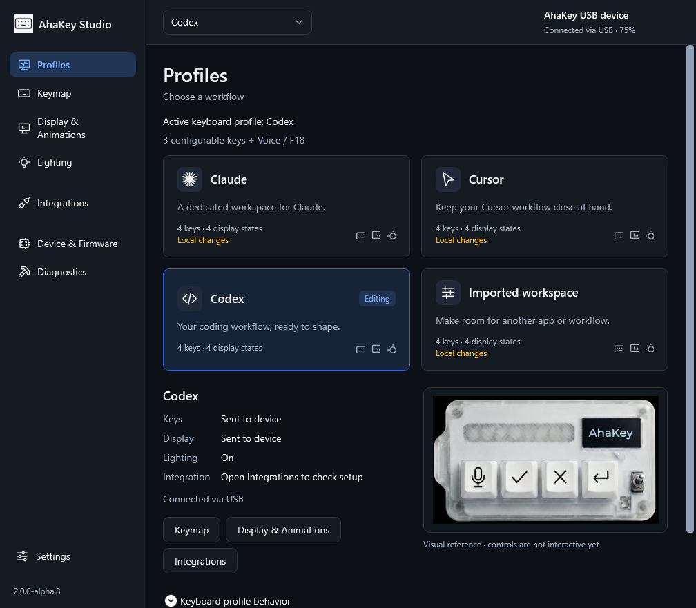
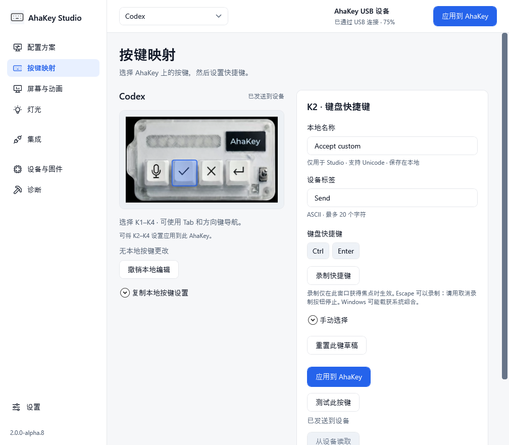
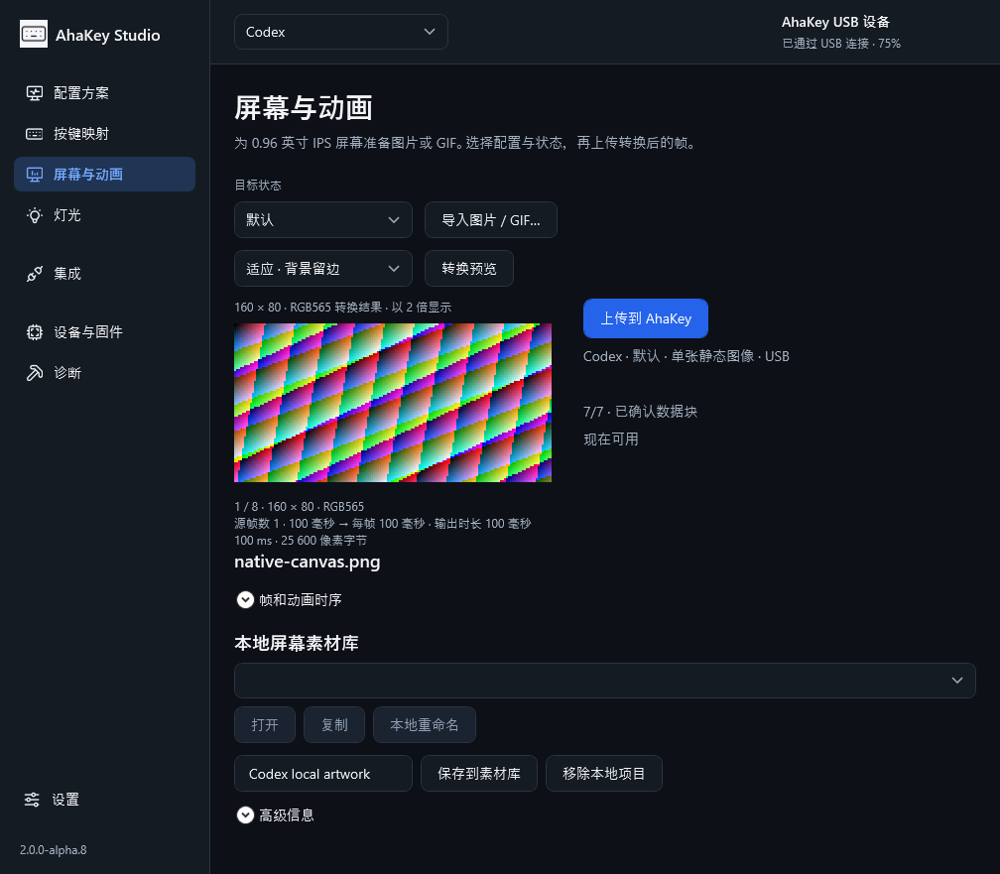

# AhaKey Studio 2 — Windows Alpha 版本提案

[English](README.md)

这是一个基于 WPF 的原生 Windows 客户端，用于配置 AhaKey X1 的按键、屏幕动画和灯光，并提供进程内 USB / 蓝牙通信及可选的 AI 助手集成。本提案与现有客户端并行存在，不替换 Java 客户端，也不修改 macOS 的打包流程。

## 体验与构建

下载 Studio 2 CI 任务生成的 Windows x64 ZIP，完整解压后运行 `AhaKey Studio.exe`。发行包自带 .NET 运行时，无需单独启动 BLE Bridge。开发者可在 Windows 上安装 `global.json` 指定的 .NET SDK，然后运行：

```powershell
dotnet restore AhaKeyStudio.sln
dotnet build AhaKeyStudio.sln -c Release
dotnet test AhaKeyStudio.sln -c Release --no-build
./Publish-Studio.ps1
```

输出目录为 `artifacts/AhaKeyStudio-win-x64/`。公开发行包不包含固件镜像或厂商烧录组件；固件页面会明确提示镜像未随包提供。选择 HEX 文件只能校验文件结构，烧录和重装功能保持禁用。

## 已实现功能

- **按键：** 四个配置方案；K2–K4 快捷键录制、手动选择及预设，USB 写入、当前快捷键部分回读，以及自动进入等待状态的实体按键测试窗口。K1 保持由固件管理的 F18，语音操作在 Windows 主机执行。
- **屏幕与动画：** 本地图片/GIF 素材库；异步解码、内存限制、取消处理、GIF 帧合成与 disposal、适应/裁剪、160×80 RGB565 转换、转换后动画预览、统一设备帧间隔及固定分配区域上传。
- **灯光：** 源码定义的 0–16 号效果、临时预览/关闭、持久化亮度及九类事件映射，写入后进行支持范围内的回读比较。不启用其他分支独有的 17 号效果。
- **集成：** 正常反馈页面只展示已配置的助手，明确显示服务状态和最近事件；集成设置及灯光反馈由用户主动启用，多会话通过统一协调器决定灯光状态。
- **设备与诊断：** 进程内 BLE/USB、按功能判断协议能力、减少状态轮询、精简脱敏诊断；本地期望值、已发送、已回读和实体观察结果分开记录。
- **界面：** 英语、简体中文、俄语；浅色/深色主题；统一图标及与实物照片对齐的按键选择区域。

现代功能针对已审阅的 WindowsContract32：固件 **1.4.8**、协议 **3.2**、型号 **1**。功能按设备能力分别启用，不依赖旧版设备的本地验收凭据。报告为 `1.0` 的旧固件保留较窄的兼容范围，未知固件不会被默认为 1.4.8。

## 验证与边界

已在一台实际 X1 / CH582M 设备上通过 USB 验证，其报告为 1.4.8 / 3.2 / capabilities 0x7FF。验证涵盖 K2–K4 写入与快捷键回读、按键测试窗口、灯光效果、亮度、持久化事件映射，以及真实 Codex 事件触发灯光。操作者确认了 K1–K4 行为、屏幕输出、亮度变化和灯光效果。最终 K3/K4 写入使用的是此前已观察到的同一快捷键，其后进行了回读，没有把此前的人眼观察冒充为新一次按键测试。

通过正常界面上传了一张静态图片和一个实际 GIF：35 个源帧、4550 ms 转为 8 个 RGB565 帧、每帧 569 ms，目标为 Codex / 默认状态、槽位 88–95。56 个数据块、绑定和保存均收到 ACK，回读元数据匹配，操作者确认了实体屏幕动画。其他已分配目标有源码和测试支持，但本次未逐一进行实体上传。

381 项软件测试通过。真实 WPF 回归场景反复切换素材和四个方案，检查取消、动画帧推进及无效文件处理。已复现并修复素材库因集合/选择通知递归导致的栈溢出。另一个仅在选择 Cursor 时发生的历史问题未能独立复现，因此不声称已证明第二个根因；已增加带操作上下文的崩溃记录。

9D 仅提供部分运行时资源回读，不等于完整持久化备份，也不能恢复标签或原屏幕像素。上传会覆盖目标像素；结果不确定时不盲目重试。本版不执行固件烧录、恢复出厂或未知协议写入。这是未签名的 Alpha 提案，并非官方稳定版。

## 截图

以下截图来自实际 WPF 程序的隔离回放场景，连接状态等数值是**测试数据**，不作为实体设备验证证据。







## 提案范围

产品源码来自本地验收检查点 `339e965`，提案基于当前 `eternal-dev`。未包含私有历史通信日志、机器/设备标识、用户原始 GIF 或受限制的固件二进制文件。公开打包仅增加缺失固件包的明确状态，并确保发行包排除固件文件。
